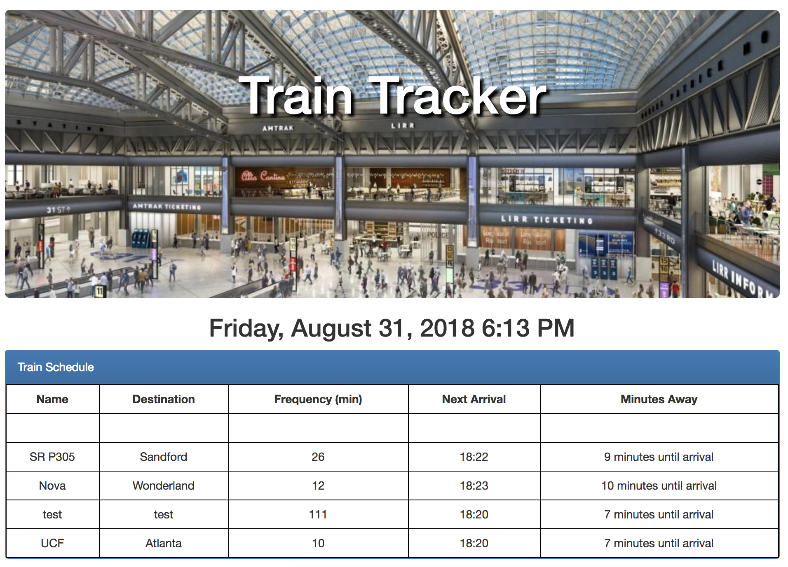
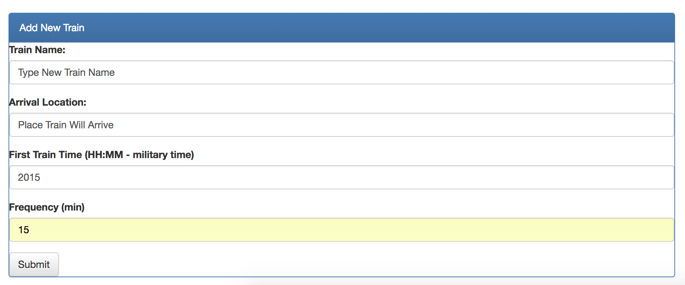

# train_track

## Overview

This is a train schedule application that incorporates Firebase to host arrival and departure data. The app will retrieve and manipulate information with Moment.js. This website provides up-to-date information about various trains, namely their arrival times and how many minutes remain until they arrive at their station.

## Live link to Scheduler:

https://highlyne.github.io/train_tracker/

## Screen Shots

